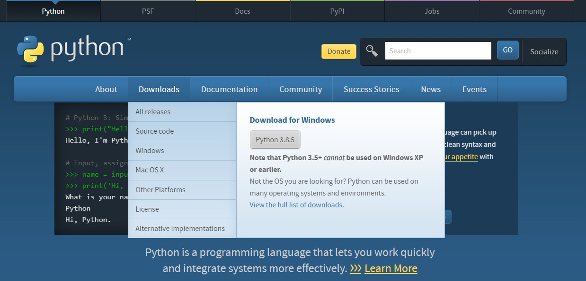
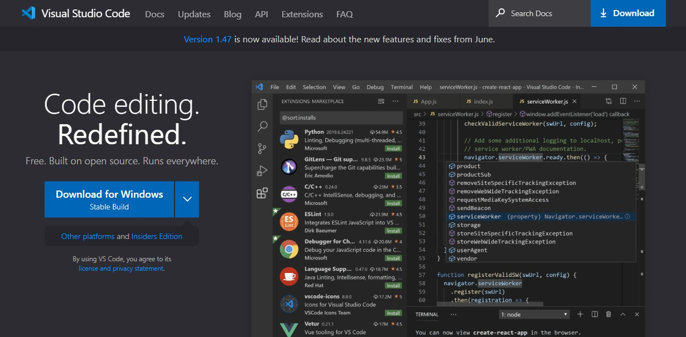

# Installing Python

### Visit https://www.python.org/

### Download the latest version and double click to install.

--- 
# Installing VS Code editor

### visit https://code.visualstudio.com/

### Download the latest version and double click to install it.

---- 
# Installing Python to Android mobile
#### Donot have Desktop or Laptop to learn.
#### Learn by installing Python 3 on Android mobile phones or tablets.

visit link https://play.google.com/store/apps/details?id=ru.iiec.pydroid3&hl=en_IN or [**click here**](https://play.google.com/store/apps/details?id=ru.iiec.pydroid3&hl=en_IN)

---
*If python command is not working in the command prompt, follow the steps below*
## Adding Python to environmental variables.

* Right click on My Computer and select Properties.
* Advanced system settings.
* Environment Variables. OR Search for Environmental variables)
* Path > Edit > New 
* C:\Users\ **NAME**\AppData\Local\Programs\Python\Python**XX**   (**NAME**:  System Name **XX**: Version Number)
* C:\Users\ **NAME**\AppData\Local\Programs\Python\Python**XX**\Scripts
Click OK