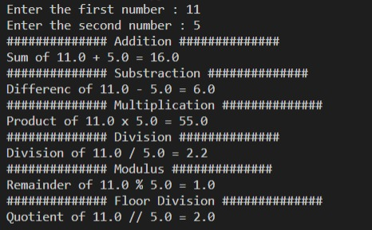

# Exercise Questions.

### This document will be updated regularly

1. [Take the input of two numbers and perform arithematic operations on it and print output as shown in the image.](../exercises/exercise1.py)

output: 

2. [Find the sum of first n positive integers.](../exercises/exercise2.py)
3. [Identify the email service providers for the list of email ids.](../exercises/exercise3.py)
``` python 
emails = ['test1@gmail.com','test2@outlook.com','test3@yahoo.com','test4@gmx.com','test4@mail.com','test4@post.com']
```

4. [Create a list of city name with STD code from the provided string below using str.strip module.](../exercises/exercise4.py)
``` python
STRING DATA:
std_code = "11 Delhi, 22 Mumbai, 33 Kolkata, 44 Chennai, 40 Hyderabad, 80 Bangalore, 20 Pune, 79 Ahmedabad"

LIST OUTPUT:
std_code_list['11 Delhi', ' 22 Mumbai', ' 33 Kolkata', ' 44 Chennai', ' 40 Hyderabad', ' 80 Bangalore', ' 20 Pune', ' 79 Ahmedabad']
```
5. [Create a dictionary from the list (output of exercise 4). keys should be city name and data should be STD code.](../exercises/exercise5.py)
``` python
Dictionary output:
{'Delhi': 11, 'Mumbai': 22, 'Kolkata': 33, 'Chennai': 44, 'Hyderabad': 40, 'Bangalore': 80, 'Pune': 20, 'Ahmedabad': 79}
```
6. [Print even numbers for the range provided by the user.](../exercises/exercise6.py)
7. [Print multiplication table from 15 to 20.](../exercises/exercise7.py)
8. [Find the Sum of Digits in a Number.](../exercises/exercise8.py)

        Eg: number = 256
        Solution = 2+5+6 = 13
9.  [Display the Fibonacci Sequences up to nth Term Where n is Provided by the User.](../exercises/exercise9.py)

        Hint: In a Fibonacci sequence, the next number is obtained by adding the previous two numbers. The first two numbers of the Fibonacci sequence are 0  and 1.
10.  [Check Whether a Number Is Prime or Not.](../exercises/exercise10.py)
----
Follow me on     <a target="_blank" href="https://www.facebook.com/skilldisk"></a>
    <a target="_blank" href="https://twitter.com/skilldisk"></a>
    <a target="_blank" href="https://t.me/skilldisk/"></a>
    <a target="_blank" href="https://github.com/skilldisk"></a>
    <a target="_blank" href="https://www.youtube.com/channel/UC41IWICHdLr7uCeeOCPFnpQ"></a>
